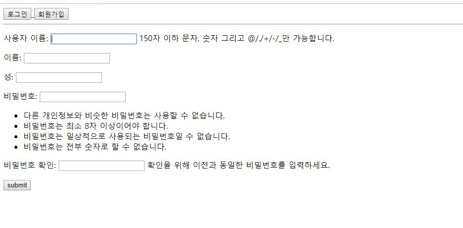
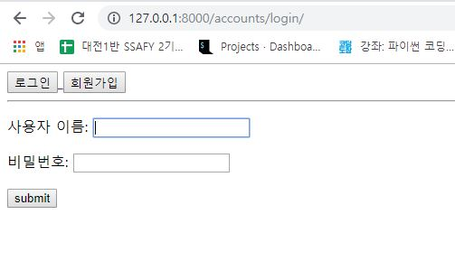
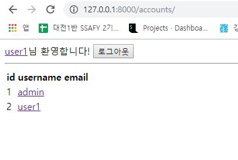
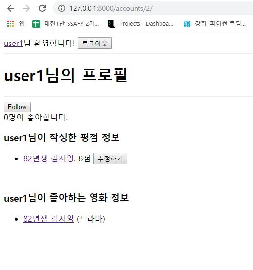
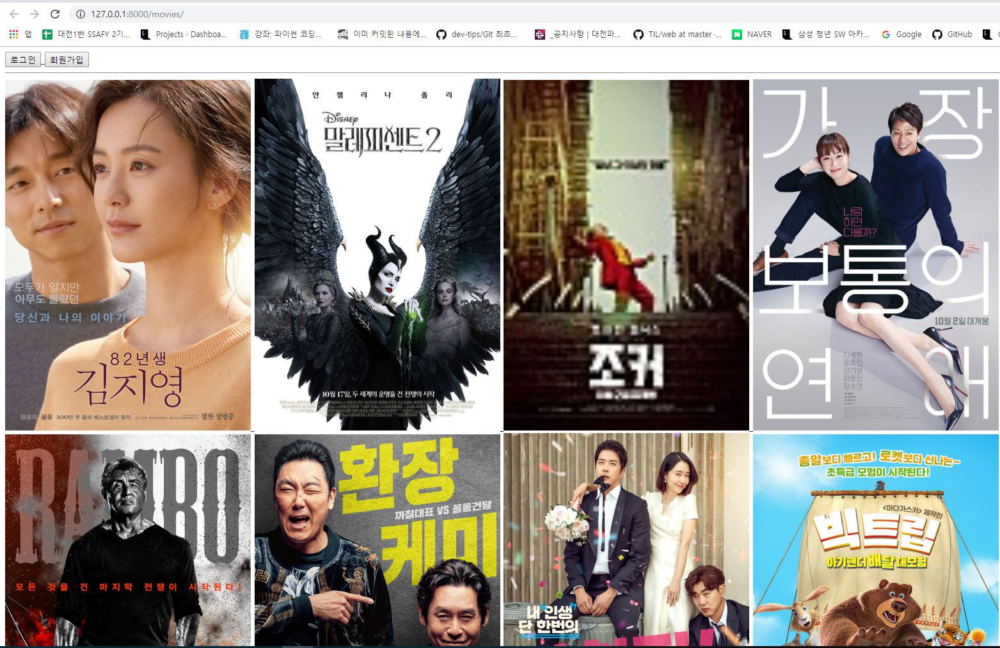

# Project 07

## 1. 목표

Pair Coding을 통한 데이터베이스를 모델링 및 영화 목록 및 상세 페이지, 유저 목록 및 상세 페이지, 좋아요 기능 구현


## 2. Pair Coding

* `requirements.txt`

  ```python
  Django==2.2.6
  pytz==2019.3
  sqlparse==0.3.0
  ```

### 1. DB 설계

`accounts/model.py`

```python
from django.db import models
from django.contrib.auth.models import AbstractUser
from django.conf import settings

# Create your models here.
class User(AbstractUser):
    followings = models.ManyToManyField(settings.AUTH_USER_MODEL, related_name='followers', blank=True)
```

`movies/model.py`

```python
from django.db import models
from django.conf import settings

# Create your models here.
# class Movie

class Genre(models.Model):
    name = models.CharField(max_length=200)

class Movie(models.Model):
    title = models.CharField(max_length=455)
    audience = models.IntegerField()
    poster_url = models.URLField()
    description = models.TextField()
    genre = models.ForeignKey(Genre, on_delete=models.CASCADE)
    like_users = models.ManyToManyField(settings.AUTH_USER_MODEL, related_name="like_movies")


class Review(models.Model):
    content = models.CharField(max_length=499)
    score = models.IntegerField()
    movie = models.ForeignKey(Movie, on_delete=models.CASCADE)
    user = models.ForeignKey(settings.AUTH_USER_MODEL, on_delete=models.CASCADE)
```


### 2. Admin 설계

`movies/admin.py`

```python
from django.contrib import admin
from .models import Movie, Genre
# Register your models here.
class MovieAdmin(admin.ModelAdmin):
    list_display = ('title', 'genre', )

class GenreAdmin(admin.ModelAdmin):
    list_display = ('name', )

admin.site.register(Movie, MovieAdmin)
admin.site.register(Genre, GenreAdmin)
```


### 3. Form 설계

`accounts/forms.py`

```python
from django import forms
from django.contrib.auth.forms import UserChangeForm, UserCreationForm
from django.contrib.auth import get_user_model

class CustomUserCreationForm(UserCreationForm):
    class Meta:
        model = get_user_model()
        fields = ('username', 'first_name', 'last_name', )

class CustomUserChangeForm(UserChangeForm):
    class Meta:
        model = get_user_model()
        fields = ('username', 'first_name', 'last_name', 'email', )
```

`movies/forms.py`

```python
from django import forms
from .models import Review

class ReviewForm(forms.ModelForm):
    class Meta:
        model = Review
        fields = ('content', 'score')
```


### 4. URL 설정

`easymean/urls.py`

```python
from django.contrib import admin
from django.urls import path, include
from django.shortcuts import redirect

def go_homepage(request):
    return redirect('movies:index')

urlpatterns = [
    path('admin/', admin.site.urls),
    path('accounts/', include('accounts.urls')),
    path('movies/', include('movies.urls')),
    path('', go_homepage),
]
```

`accounts/urls.py`

```python
from django.urls import path
from . import views

app_name = 'accounts'

urlpatterns = [
    path('', views.index, name="index"),
    path('signup/', views.signup, name='signup'),
    path('login/', views.login, name="login"),
    path('logout/', views.logout, name="logout"),
    path('<int:user_pk>/', views.detail, name="detail"),
    path('<int:user_pk>/follow/', views.follow, name='follow'),
]
```

`movies/urls.py`

```python
from django.urls import path
from . import views

app_name = 'movies'

urlpatterns = [
    path('', views.index, name="index"),
    path('<int:movie_pk>/', views.detail, name="detail"),
    path('<int:movie_pk>/reviews/new/', views.review_create, name="review_create"),
    path('<int:movie_pk>/reviews/<int:review_pk>/delete/', views.review_delete, name="review_delete"),
    path('<int:movie_pk>/like/', views.like, name='like'),
    path('<int:review_pk>/update_score/', views.update_score, name="update_score"),
]
```


### 5. View 정의

`accounts/views.py`

```python
from django.shortcuts import render, redirect, get_object_or_404
from django.contrib.auth import get_user_model
from django.contrib.auth.decorators import login_required
from .forms import CustomUserChangeForm, CustomUserCreationForm
from django.contrib.auth import login as auth_login
from django.contrib.auth import logout as auth_logout
from django.contrib.auth.forms import AuthenticationForm

# Create your views here.
def index(request):
    context = {
        'users': get_user_model().objects.all()
    }
    return render(request, 'accounts/index.html', context)

def signup(request):
    if request.method == 'POST':
        form = CustomUserCreationForm(request.POST)
        if form.is_valid():
            auth_login(request, form.save())
            return redirect('accounts:index')
    else:
        form = CustomUserCreationForm()
    context = {
        'form': form
    }
    return render(request, 'accounts/form.html', context)

def login(request):
    if request.user.is_authenticated:
        return redirect('accounts:index')
    if request.method == 'POST':
        form = AuthenticationForm(request, request.POST)
        if form.is_valid():
            auth_login(request, form.get_user())
            return redirect('accounts:index')
    else:
        form = AuthenticationForm()
    context = {
        'form': form
    }
    return render(request, 'accounts/form.html', context)

def logout(request):
    auth_logout(request)
    return redirect('accounts:index')

def detail(request, user_pk):
    context = {
        'user_profile': get_user_model().objects.get(pk=user_pk)
    }
    return render(request, 'accounts/detail.html', context)

@login_required
def follow(request, user_pk):
    user = get_object_or_404(get_user_model(), pk=user_pk)
    if request.user != user:
        if user in request.user.followings.all():
            request.user.followings.remove(user)
        else:
            request.user.followings.add(user)
    return redirect('accounts:detail', user_pk)
```

`movies/views.py`

```python
from django.shortcuts import render, redirect, get_object_or_404
from .models import Movie, Review
from django.contrib.auth.decorators import login_required
from django.views.decorators.http import require_POST
from .forms import ReviewForm
from django.contrib import messages

# Create your views here.
def index(request):
    context = {
        'movies': Movie.objects.all()
    }
    return render(request, 'movies/index.html', context)

def detail(request, movie_pk):
    context = {
        'movie': get_object_or_404(Movie, pk=movie_pk),
        'form': ReviewForm()
    }
    return render(request, 'movies/detail.html', context)
    
@require_POST
def review_create(request, movie_pk):
    if request.user.is_authenticated:
        form = ReviewForm(request.POST)
        if form.is_valid():
            review = form.save(commit=False)
            review.user = request.user
            review.movie_id = movie_pk
            review.save()
    else:
        messages.warning(request, '로그인이 필요합니다.')
    return redirect('movies:detail', movie_pk)

def review_delete(request, movie_pk, review_pk):
    review = get_object_or_404(Review, pk=review_pk)
    if request.user == review.user:
        review.delete()
    else:
        messages.warning(request, '리뷰 삭제 권한이 없습니다.')
    return redirect('movies:detail', movie_pk)

@require_POST
def like(request, movie_pk):
    movie = get_object_or_404(Movie, pk=movie_pk)
    if request.user.is_authenticated:
        if movie in request.user.like_movies.all():
            request.user.like_movies.remove(movie)
        else:
            request.user.like_movies.add(movie)
    else:
        messages.warning(request, '로그인이 필요한 기능입니다.')
    return redirect('movies:detail', movie_pk)

def update_score(request, review_pk):
    review = get_object_or_404(Review, pk=review_pk)
    if request.user == review.user:
        if request.method == 'POST':
            form = ReviewForm(request.POST, instance=review)
            if form.is_valid():
                form.save()
                return redirect('accounts:detail', review.user.pk)
        else:
            form = ReviewForm(instance=review)
        context = {
            'form': form
        }
        return render(request, 'accounts/form.html', context)
    else:
        messages.warning(request, '수정 권한이 없습니다.')
    return redirect('accounts:detail', review.user.pk)
```


### 6. 템플릿 구현

* `easymean/templates/base.html` : 기본 base 구성
* `accounts/templates/accounts/index.html` : 유저 목록
* `accounts/templates/accounts/detail.html` : 유저 상세 페이지 - 좋아하는 영화, 작성한 리뷰 등
* `accounts/templates/accounts/form.html` : 유저 회원가입 및 로그인
* `movies/templates/movies/index.html` : 영화 목록
* `movies/templates/movies/detail.html` : 영화 상세 페이지 - 영화 정보 및 리뷰 목록, 리뷰 작성 폼


### 7. 결과

* **회원가입**

  

* **로그인**

  

* **유저 목록**

  

* **유저 상세 페이지**

  

* **영화 목록**

  

* **영화 상세 페이지**

  

